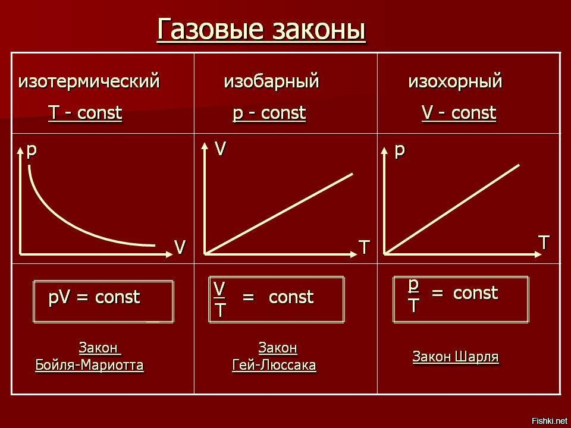

# Газовые законы

Решение задач на расчет параметров газа значительно упрощается, если Вы знаете, какой закон и какую формулу применить. Итак, рассмотрим основные газовые законы.

1. Закон Авогадро. В одном моле любого вещества содержится одинаковое количество структурных элементов, равное числу Авогадро.

2. Закон Дальтона. Давление смеси газов равно сумме парциальных давлений газов, входящих в эту смесь:

$p=p_1+p_2+p_3+...$

Парциальным давлением газа называют то давление, которое он бы производил, если бы все остальные газ внезапно исчезли из смеси. Например, давление воздуха равно сумме парциальных давлений азота, кислорода, углекислого газа и прочих примесей. При этом каждый из газов в смеси занимает весь предоставленный ему объем, то есть объем каждого из газов равен объему смеси.

3. Закон Бойля-Мариотта. Если масса и температура газа остаются постоянными, то произведение давления газа на его объем не изменяется, следовательно:

Если: $m=const$ и $T=const$ , то: $pV=const$.

Процесс, происходящий при постоянной температуре, называют изотермическим. Обратите внимание, что такая простая форма закона Бойля-Мариотта выполняется только при условии, что масса газа остается неизменной.

4. Закон Гей-Люссака. Сам закон Гей-Люссака не представляет особой ценности при подготовке к экзаменам, поэтому приведем лишь следствие из него. Если масса и давление газа остаются постоянными, то отношение объема газа к его абсолютной температуре не изменяется, следовательно:

Если: $m=const$ и $p=const$ ,то: $\frac{V}{T}=const$

Процесс, происходящий при постоянном давлении, называют изобарическим или изобарным. Обратите внимание, что такая простая форма закона Гей-Люссака выполняется только при условии, что масса газа остается неизменной. Не забывайте про перевод температуры из градусов Цельсия в кельвины.

5. Закон Шарля. Как и закон Гей-Люссака, закон Шарля в точной формулировке для нас не важен, поэтому приведем лишь следствие из него. Если масса и объем газа остаются постоянными, то отношение давления газа к его абсолютной температуре не изменяется, следовательно:

Если: $m=const$ ,то: $\frac{pV}{T}=const$

Обратите внимание, что масса должна оставаться неизменной, и не забывайте про кельвины.

Итак, существует несколько газовых законов. Перечислим признаки того, что нужно применять один из них при решении задачи:

Закон Авогадро применяется во всех задачах где речь идет о количестве молекул.
Закон Дальтона применяется во всех задачах, в которых идет речь о смеси газов.
Закон Шарля применяют в задачах, когда объем газа остается неизменным. Обычно это или сказано явно, или в задаче присутствуют слова «газ в закрытом сосуде без поршня».
Закон Гей-Люссака применяют, если неизменным остается давление газа. Ищите в задачах слова «газ в сосуде, закрытом подвижным поршнем» или «газ в открытом сосуде». Иногда про сосуд ничего не сказано, но по условию понятно, что он сообщается с атмосферой. Тогда считается, что атмосферное давление всегда остается неизменным (если в условии не сказано иного).
Закон Бойля-Мариотта. Тут сложнее всего. Хорошо, если в задаче написано, что температура газа неизменна. Чуть хуже, если в условии присутствует слово «медленно». Например, газ медленно сжимают или медленно расширяют. Еще хуже, если сказано, что газ закрыт теплонепроводящим поршнем. Наконец, совсем плохо, если про температуру не сказано ничего, но из условия можно предположить, что она не изменяется. Обычно в этом случае ученики применяют закон Бойля-Мариотта от безысходности.
Универсальный газовый закон. Его используют, если масса газа постоянна (например, газ находится в закрытом сосуде), но по условию понятно, что все остальные параметры (давление, объем, температура) изменяются. Вообще, часто вместо универсального закона можно применять уравнение Клапейрона-Менделеева, вы получите правильный ответ, только в каждой формуле будете писать по две лишние буквы.
 
