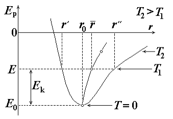

# Тепловое расширение тел 

Тепловым расширением называется эффект изменения размеров тела с изменением его температуры при постоянном давлении. Температурным коэффициентом объемного расширения &beta; называется относительное изменение объема V при изобарическом нагревании тела, отнесенное к малому изменению его температуры:

$&beta;=(\frac{dV}{VdT})_{P=const}$

Большинство тел при нагревании расширяются, а при охлаждении – сжимаются. Для них &beta; > 0. Однако есть и исключения. Среди жидкостей это вода, которая при охлаждении от 4°С до 0°С расширяется и имеет самую большую плотность при 4°С. Аналогичную особенность имеет один из никелевых сплавов при низких температурах (ниже 50 К) и ряд других соединений. Качественно тепловое расширение тел может быть достаточно просто объяснено на основе молекулярно – кинетической теории с помощью графика зависимости энергии взаимодействия двух молекул от расстояния между ними. При температуре, близкой к абсолютному нулю, полная энергия молекул представляет собой практически только потенциальную, соответствующую равновесному расстоянию $r_0$ между молекулами (точка минимума на графике потенциальной энергии $E_p$(r)).При повышении температуры полная энергия молекул возрастает за счет увеличения кинетической энергии. В результате расстояние между молекулами в процессе их теплового колебания относительно положения равновесия начинает изменяться. 

Например, при некоторой температуре T1 расстояние между молекулами меняется от r’ до r” (см. рисунок). В этих предельных точках молекулы останавливаются, и их полная энергия равна потенциальной энергии их взаимодействия. При этом принципиальное значение имеет несимметричность 2 кривой $E_p$(r). Это приводит к тому, что среднее значения расстояния между молекулами с повышением температуры меняется. Причем, если при относительно низких температурах среднее значения расстояния между молекулами может уменьшаться, то начиная с некоторой температуры (разной для разных тел) оно может только увеличиваться, что соответствует тепловому расширению тел. Для твердых тел кроме температурного коэффициента объемного расширения часто используют также температурный коэффициент линейного расширения:

$&alpha;=(\frac{dl}{ldT})_{P=const}$

где l – размер тела в данном направлении, а dl – изменение этого размера при изобарическом изменении температуры тела на малую величину dT. Для многих твердых материалов их свойства, в том числе способность к тепловому расширению, различны в различных направлениях. Такие материалы называют анизотропными. Например, шар, вырезанный из анизотропного материала, при нагревании преобразуется в эллипсоид. Для изотропных сред температурный коэффициент линейного расширения α не зависит от направления, и, следовательно, шар радиуса R0, вырезанный из изотропного материала, при нагревании остается шаром, только имеет другой радиус R = R0(1 + αdT). Соответственно его новый объем равен $V=V_0(1 + &alpha;dT)^3=V_0(1 + 3&alpha;dT + …)$, где в последней формуле опущены малые слагаемые квадратичные и кубичные по αdT. Отсюда сразу следует, что для изотропных твердых тел

$&beta;=3&alpha;$

где l – размер тела в данном направлении, а dl – изменение этого размера при изобарическом изменении температуры тела на малую величину dT. Для многих твердых материалов их свойства, в том числе способность к тепловому расширению, различны в различных направлениях. Такие материалы называют анизотропными. Например, шар, вырезанный из анизотропного материала, при нагревании преобразуется в эллипсоид. Для изотропных сред температурный коэффициент линейного расширения α не зависит от направления, и, следовательно, шар радиуса R0, вырезанный из изотропного материала, при нагревании остается шаром, только имеет другой радиус $R=R_0(1 + &alpha;dT)$. Соответственно его новый объем равен $V=V_0(1 + &alpha;dT)^3=V_0(1 + 3&alpha;dT + …)$, где в последней формуле опущены малые слагаемые квадратичные и кубичные по αdT. Отсюда сразу следует, что для изотропных твердых телЗаметим, что температурные коэффициенты объемного и линейного расширения, вообще говоря, зависят от температуры. Например, для идеального газа под поршнем, учитывая уравнение Клапейрона – Менделеева, получим, что при постоянном давлении PdV = &nu;RdT = PVdT/T, и, следовательно, температурный коэффициент объемного расширения &beta; = 1/Т. Для жидкостей и твердых тел эта зависимость обычно не столь существенная, и в не очень больших температурных интервалах ею часто можно пренебречь. В этом случае размеры тел при температурах T и T0 можно связать простыми соотношениями вида:

$L(T)=L(T_0)[1+&alpha;(T-T_0)]$

$V(T)=V(T_0)[1+&beta;(T-T_0)]$,

где L(T) [V(T)] и $L(T_0) [V(T_0)]$ – длина [объем] тела при температуре T и $T_0$ соответственно.
